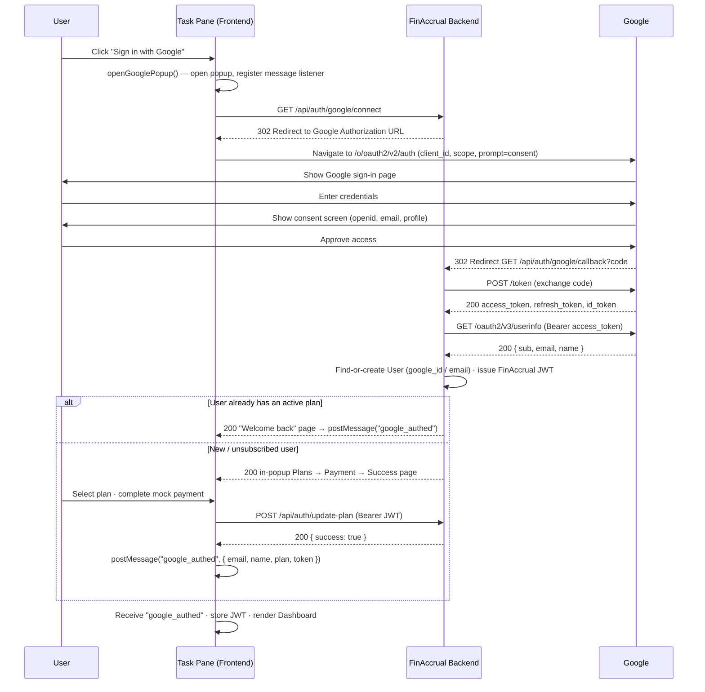
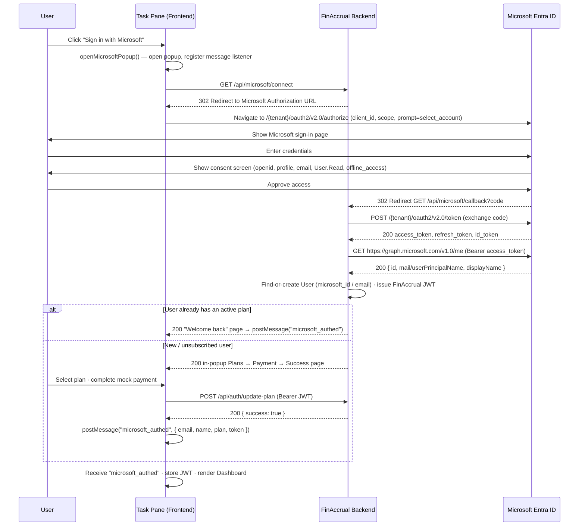
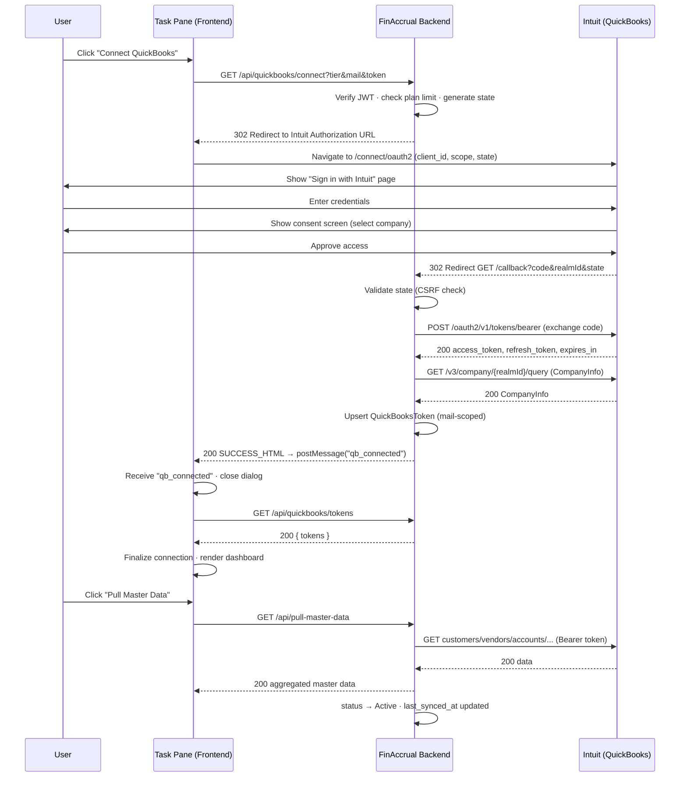
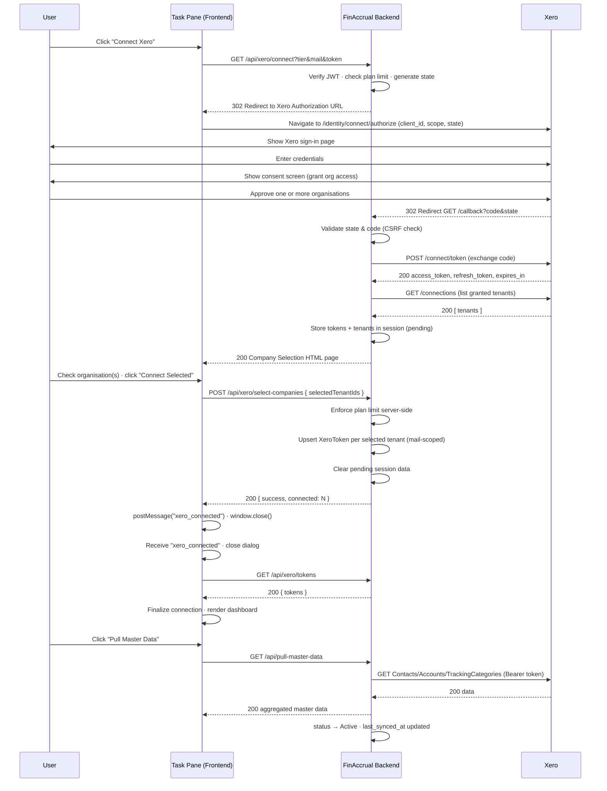
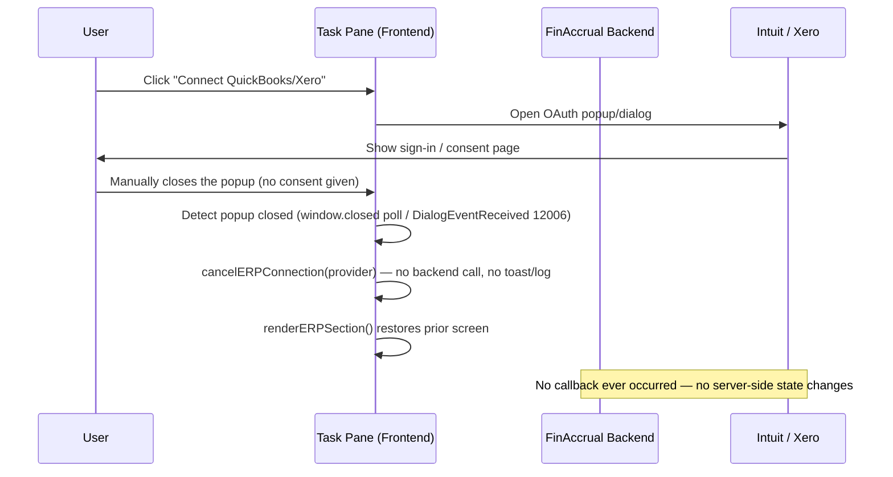
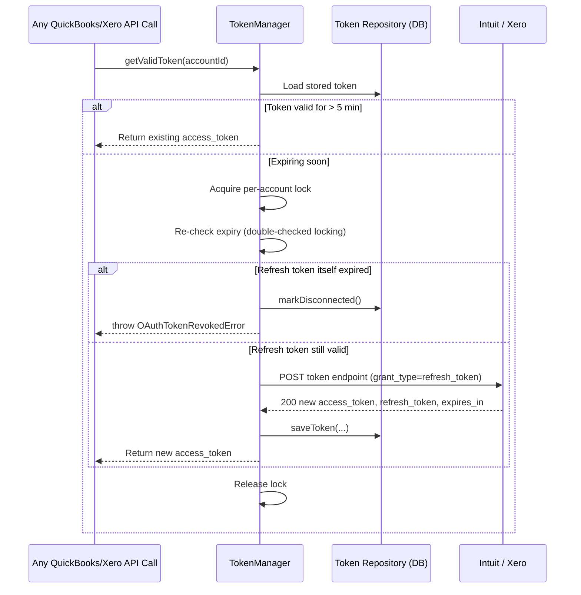

# Google, Microsoft, Intuit (QuickBooks Online) & Xero — OAuth 2.0 Authentication Workflow

**Application:** FinAccrual (Excel Office Add-in)
**Flow type:** OAuth 2.0 Authorization Code Grant
**Providers:** Google, Microsoft (Entra ID), Intuit (QuickBooks Online), Xero
**Audience:** Developers integrating with, maintaining, or auditing the authentication and ERP connection layers

---

## 1. Overview

FinAccrual ERP uses the **OAuth 2.0 Authorization Code Flow** to securely connect with external platforms — Google and Microsoft for user sign-in, and Intuit (QuickBooks Online) and Xero for accounting data. Instead of storing user credentials, the application receives an **Access Token** and **Refresh Token** after the user authorizes the application. These tokens are then used for all authenticated API requests. Although all four platforms use OAuth 2.0, their connection process differs based on how they manage identity and companies/organizations — Google and Microsoft each resolve a single user identity used for FinAccrual login, QuickBooks Online resolves a single company (`realmId`) directly from the callback, while Xero can grant access to multiple organisations at once, requiring an explicit in-app company-selection step before tokens are persisted (see §6, Steps 10–15).

FinAccrual connects to Google/Microsoft so users can sign in without a separate FinAccrual password, and to QuickBooks Online/Xero so users can pull accounting master data (customers, vendors, accounts, classes, locations) into Excel. All four integrations use the standard **OAuth 2.0 Authorization Code flow**. The two identity providers (Google, Microsoft) feed directly into FinAccrual's own **JWT application session**; the two ERP providers (QuickBooks, Xero) are authorized separately, after that JWT session already exists.

### 1.1 One-Line Summaries

- **Sign in with Google** – Authenticates users using Google OAuth and returns application authentication tokens.
- **Sign in with Microsoft** – Authenticates users using Microsoft OAuth and returns application authentication tokens.
- **Sign in with Intuit** – Authenticates users with Intuit and authorizes access to QuickBooks Online through OAuth 2.0.
- **Connect QuickBooks** – Initiates the QuickBooks OAuth flow using the `GET /api/quickbooks/connect` API to establish a secure ERP connection.
- **Connect Xero** – Initiates the Xero OAuth flow using the `GET /api/xero/connect` API to securely connect one or more Xero organizations.

Two authentication systems are in play at all times:

| Layer | Purpose | Mechanism |
|---|---|---|
| **App session** | Identifies which FinAccrual user is using the add-in | JWT issued at login (via local signup/login, Google, or Microsoft), sent as `Authorization: Bearer <token>` on every API call |
| **ERP OAuth** | Grants FinAccrual access to a user's QuickBooks/Xero accounting data | OAuth 2.0 Authorization Code flow against Intuit / Xero, initiated only after an app session already exists |

Every ERP connection is permanently tied to the `mail` (email) claim from the verified JWT — never to a client-supplied query parameter — so one user's QuickBooks or Xero data can never be seen or modified by another authenticated user.

**Key architectural components:**

- **Frontend:** `taskpane.js` (Office.js task pane) — `AuthService.openGooglePopup()` / `openMicrosoftPopup()` for login, `DashboardService.launchERPOAuth()` for ERP connections, `Office.context.ui.displayDialogAsync` (or `window.open` fallback) for both, message-based popup completion signaling throughout.
- **Backend:** Express routes/controllers per provider (`modules/auth/*` for Google/Microsoft, `modules/quickbooks/*`, `modules/xero/*`), `express-session` for transient OAuth state, Sequelize models for durable storage (`User`, `QuickBooksToken`, `XeroToken`).
- **Token lifecycle engine:** A shared `TokenManager` base class (`core/oauth/TokenManager.js`) with per-provider `OAuthClient` and `TokenRepository` implementations, handling proactive refresh and revocation for QuickBooks/Xero. Google/Microsoft tokens are used transiently during login only (see §3–§4) and are not persisted or refreshed by FinAccrual.

---

## 2. Workflow Diagrams (Visual Summary)

These sequence diagrams show all four OAuth workflows end to end — Google, Microsoft, QuickBooks, Xero — plus the shared cancellation path and token refresh engine, before the step-by-step reference tables in §3–§7.

### 2.1 Google Sign-In — OAuth Sequence

### 2.2 Microsoft Sign-In — OAuth Sequence

### 2.3 QuickBooks Online — OAuth Sequence

### 2.4 Xero — OAuth Sequence (Multi-Organisation Selection)

### 2.5 Cancellation Path (ERP Providers)

### 2.6 Ongoing Token Refresh (Shared Engine, QuickBooks & Xero)

---

## 3. Google Sign-In — Chronological OAuth 2.0 Flow

Google is one of two identity providers FinAccrual uses for application login (the other is Microsoft, §4). A successful Google sign-in produces a FinAccrual `User` record and a FinAccrual JWT — it does not, by itself, connect any accounting data; that only happens later via §5/§6.

### Step 1 — User Initiates Sign-In

**Description:** The user clicks **"Sign in with Google"** on the FinAccrual Welcome screen.

| | |
|---|---|
| **Request/Response** | None (local UI event) |
| **Frontend action** | `AuthService.openGooglePopup()` opens a popup window and registers a `window.addEventListener("message", msgHandler)` listener before navigating it. |
| **Backend action** | None yet. |
| **Expected outcome** | A Google sign-in popup opens. |

### Step 2 — Authorization Request Construction & Redirect

**Description:** The backend builds Google's authorization URL and redirects the popup to it.

| | |
|---|---|
| **Request/Response** | `GET /api/auth/google/connect` → `302 Found` → `Location: https://accounts.google.com/o/oauth2/v2/auth?client_id=...&redirect_uri=...&response_type=code&scope=openid email profile&access_type=offline&prompt=consent` |
| **Frontend action** | Popup follows the redirect automatically. |
| **Backend action** | `googleConnect()` calls `AuthService.getGoogleAuthUrl()` → `GoogleAuthService.getAuthUrl()`, which builds the URL from `config.GOOGLE.CLIENT_ID` and `config.GOOGLE.REDIRECT_URI`. `access_type=offline&prompt=consent` forces Google to issue a refresh token on every authorization, not just the first. |
| **Expected outcome** | The popup displays Google's hosted sign-in page. |

### Step 3 — User Sign-In with Google

**Description:** The user authenticates with their Google credentials on `accounts.google.com`.

| | |
|---|---|
| **Request/Response** | Handled entirely on Google's servers; FinAccrual is not involved. |
| **Frontend action** | None. |
| **Backend action** | None. |
| **Expected outcome** | Google authenticates the user and proceeds to the consent screen. |

### Step 4 — User Consent

**Description:** Google shows the requested scopes (`openid`, `email`, `profile`) and asks the user to approve access.

| | |
|---|---|
| **Request/Response** | Google-hosted consent UI. |
| **Frontend action** | None. |
| **Backend action** | None. |
| **Expected outcome** | User approves (or denies) access. If denied or the popup is closed at this point, no callback occurs and no message is ever sent back to the task pane (see §7 for the equivalent ERP-side behavior; the Google/Microsoft login popups have no `window.closed` poller, so a manual close here simply leaves the task pane on its current screen). |

### Step 5 — Authorization Code Issued & Redirect to Callback

**Description:** On approval, Google redirects the popup back to FinAccrual with an authorization code.

| | |
|---|---|
| **Request/Response** | `302 Found` → `GET /api/auth/google/callback?code={authCode}` |
| **Frontend action** | Popup follows the redirect. |
| **Backend action** | None yet. |
| **Expected outcome** | The callback endpoint receives a short-lived, single-use authorization code. |

### Step 6 — Authorization Code → Token Exchange

**Description:** The server exchanges the authorization code for Google's access, refresh, and ID tokens.

| | |
|---|---|
| **Request/Response** | `POST https://oauth2.googleapis.com/token` with `code, client_id, client_secret, redirect_uri, grant_type=authorization_code` → `200 OK { access_token, refresh_token, id_token, expires_in, ... }` |
| **Frontend action** | None (server-to-server). |
| **Backend action** | `googleCallback()` calls `AuthService.handleGoogleCallback(code)` → `GoogleAuthService.exchangeCodeForToken(code)`. |
| **Expected outcome** | A valid Google access token is obtained. Note: unlike QuickBooks/Xero, these Google tokens are used transiently and are **not** persisted anywhere in FinAccrual's database — only the resulting FinAccrual `User`/JWT (Steps 8–9) is stored. |

### Step 7 — Fetch Google Profile

**Description:** The server calls Google's userinfo endpoint to retrieve the signed-in user's identity.

| | |
|---|---|
| **Request/Response** | `GET https://www.googleapis.com/oauth2/v3/userinfo`, `Authorization: Bearer {access_token}` → `200 OK { sub, email, name, picture }` |
| **Frontend action** | None. |
| **Backend action** | `GoogleAuthService.getUserProfile(access_token)`. |
| **Expected outcome** | The user's Google `sub` (stable ID), `email`, and `name` are retrieved. |

### Step 8 — User Upsert (Find-or-Create Account)

**Description:** The server matches the Google identity to an existing FinAccrual account, or creates a new one.

| | |
|---|---|
| **Request/Response** | Internal DB lookups/writes (`UserRepository.findByGoogleId`, `findByEmail`, `create`, `update`) |
| **Frontend action** | None. |
| **Backend action** | `handleGoogleCallback()` looks up the user by `google_id` first; if not found, falls back to an email match (covers a user who originally signed up with a local password or via Microsoft); if still not found, creates a new `User` row with `provider: 'google'`, `google_id`. A returning user missing `google_id` gets it backfilled. |
| **Expected outcome** | A FinAccrual `User` record now exists and is linked to this Google identity. |

### Step 9 — Application JWT Issuance

**Description:** The server issues FinAccrual's own application-session token — entirely separate from Google's OAuth tokens.

| | |
|---|---|
| **Request/Response** | Internal: `JwtService.generateToken({ userId, email, role })` |
| **Frontend action** | None. |
| **Backend action** | `AuthService._buildToken(user)` signs a 24-hour JWT. |
| **Expected outcome** | A FinAccrual JWT is ready to hand to the frontend. |

### Step 10 — Callback Response (Plan-Aware Branching)

**Description:** The server renders one of two in-popup pages depending on whether the user already has an active subscription plan.

| | |
|---|---|
| **Request/Response** | `200 OK` — either a brief "Welcome back" auto-continue page, or the full in-popup Plans → Payment → Success onboarding page. |
| **Frontend action** | Popup displays the corresponding screen. |
| **Backend action** | `googleCallback()` branches on `user.plan`. |
| **Expected outcome** | Existing subscribers see a brief "Logging you in…" screen; new/unsubscribed users see plan selection and a (mocked) payment form, entirely inside the popup. |

### Step 11 — Plan Selection & Mock Payment (New/Unsubscribed Users Only)

**Description:** The user chooses a plan (Basic/Standard/Pro) and completes a simulated payment form inside the popup.

| | |
|---|---|
| **Request/Response** | Client-side only, inside the popup (`selectPlan()`, `processPayment()`). No real payment gateway is called — this is a mocked checkout UI; no card data leaves the popup. |
| **Frontend action** | None (the popup, not the task pane, drives this step). |
| **Backend action** | None yet. |
| **Expected outcome** | A plan is selected and the popup proceeds to persist it. |

### Step 12 — Plan Persistence

**Description:** The popup saves the selected plan against the now-authenticated user.

| | |
|---|---|
| **Request/Response** | `POST /api/auth/update-plan`, `Authorization: Bearer {jwt}`, `{ plan }` → `200 OK { success: true }` |
| **Frontend action** | None (called by the popup's own script, `saveSelectedPlan()`, which retries once on failure). |
| **Backend action** | `updatePlan()` updates the `User` row; if this represents a downgrade from a previously higher plan, it also clears QuickBooks/Xero connections beyond the new plan's allowed limit. |
| **Expected outcome** | The user's plan is persisted server-side. |

### Step 13 — Completion Signal to Task Pane

**Description:** The popup sends the full authentication payload back to the task pane and closes itself.

| | |
|---|---|
| **Request/Response** | In-memory: `window.opener.postMessage({ type: 'google_authed', email, name, subscriptionId, plan, billingCycle, token }, '*')` (or `Office.context.ui.messageParent(...)` inside the Office dialog), then `window.close()`. |
| **Frontend action** | None yet — emitted by the popup's own script. |
| **Backend action** | None. |
| **Expected outcome** | Popup closes; a `"google_authed"` message is emitted. |

### Step 14 — Frontend Receives Completion & Establishes Session

**Description:** The task pane's listener receives the message and finalizes the authenticated session — only now, never before.

| | |
|---|---|
| **Request/Response** | In-memory message event. |
| **Frontend action** | The handler registered in `openGooglePopup()` matches `data.type === "google_authed"`, removes the listener, and calls `AuthService.handleNewUserAuthed(email, name, "google", subscriptionId, plan, token)`, which stores the JWT (`AppState.jwtToken`, `localStorage.fa_jwt_token`) and profile/subscription fields, then renders the Dashboard. |
| **Backend action** | None. |
| **Expected outcome** | The user is signed in; a single "Login successful." status entry is shown; the Dashboard view is active with a valid JWT attached to all subsequent API calls. |

**Returning-user variant:** If the popup instead sends `{ type: 'google_profile', email, name, token }` (a returning user who already completed onboarding), the handler calls `AuthService.handleReturningUser(...)` instead, which calls `ApiService.checkSubscription(email)` to confirm an active plan before routing to the Dashboard (or to the Plans screen if no plan is found).

**Cancellation:** If the user clicks the popup's own "Logout" control, the popup sends `{ type: 'google_cancelled' }`; the task pane's handler removes its listener and calls `ViewRouter.show("Welcome")` with no toast or error message. There is no `window.closed` polling on this popup (unlike the ERP connect flow in §7), so if the user closes the tab directly instead of using the in-popup control, no message is ever received and the task pane simply remains on whatever screen it was already showing.

---

## 4. Microsoft Sign-In — Chronological OAuth 2.0 Flow

Microsoft sign-in mirrors the Google flow (§3) step-for-step, against Microsoft's Entra ID (Azure AD) v2.0 endpoint instead of Google's, with a Microsoft Graph profile lookup in place of Google's userinfo endpoint.

### Step 1 — User Initiates Sign-In

**Description:** The user clicks **"Sign in with Microsoft"** on the FinAccrual Welcome screen.

| | |
|---|---|
| **Request/Response** | None (local UI event) |
| **Frontend action** | `AuthService.openMicrosoftPopup()` opens a popup window and registers a `window.addEventListener("message", msgHandler)` listener before navigating it. |
| **Backend action** | None yet. |
| **Expected outcome** | A Microsoft sign-in popup opens. |

### Step 2 — Authorization Request Construction & Redirect

**Description:** The backend builds Microsoft's authorization URL and redirects the popup to it.

| | |
|---|---|
| **Request/Response** | `GET /api/microsoft/connect` (top-level alias mounted in `routes/index.js`; equivalent to `/api/auth/microsoft/connect`) → `302 Found` → `Location: https://login.microsoftonline.com/{tenant}/oauth2/v2.0/authorize?client_id=...&redirect_uri=...&response_type=code&response_mode=query&scope=openid profile email User.Read offline_access&prompt=select_account` |
| **Frontend action** | Popup follows the redirect automatically. |
| **Backend action** | `microsoftConnect()` calls `AuthService.getMicrosoftAuthUrl()` → `MicrosoftAuthService.getAuthUrl()`, built from `config.MICROSOFT.CLIENT_ID`, `REDIRECT_URI`, `TENANT_ID` (defaults to `consumers`), and `SCOPES`. `prompt=select_account` forces the account chooser even if the browser already has an active Microsoft session. |
| **Expected outcome** | The popup displays Microsoft's hosted sign-in page. |

### Step 3 — User Sign-In with Microsoft

**Description:** The user authenticates with their Microsoft (work/school or personal) credentials on `login.microsoftonline.com`.

| | |
|---|---|
| **Request/Response** | Handled entirely on Microsoft's servers. |
| **Frontend action** | None. |
| **Backend action** | None. |
| **Expected outcome** | Microsoft authenticates the user and proceeds to consent. |

### Step 4 — User Consent

**Description:** Microsoft shows the requested scopes (`openid`, `profile`, `email`, `User.Read`, `offline_access`) and asks the user to approve access.

| | |
|---|---|
| **Request/Response** | Microsoft-hosted consent UI. |
| **Frontend action** | None. |
| **Backend action** | None. |
| **Expected outcome** | User approves (or denies) access. As with Google, there is no popup-closed detection here, so a manually closed popup with no consent leaves the task pane on its current screen with no message and no error. |

### Step 5 — Authorization Code Issued & Redirect to Callback

**Description:** On approval, Microsoft redirects the popup back to FinAccrual with an authorization code.

| | |
|---|---|
| **Request/Response** | `302 Found` → `GET /api/microsoft/callback?code={authCode}` (or `?error=...&error_description=...` if the user denied consent) |
| **Frontend action** | Popup follows the redirect. |
| **Backend action** | None yet. |
| **Expected outcome** | The callback endpoint receives either an authorization code or an explicit denial. |

### Step 6 — Authorization Code → Token Exchange

**Description:** The server exchanges the authorization code for Microsoft's access, refresh, and ID tokens.

| | |
|---|---|
| **Request/Response** | `POST https://login.microsoftonline.com/{tenant}/oauth2/v2.0/token` with `code, client_id, client_secret, redirect_uri, grant_type=authorization_code, scope` → `200 OK { access_token, refresh_token, id_token, expires_in, ... }` |
| **Frontend action** | None (server-to-server). |
| **Backend action** | `microsoftCallback()` first checks for an `error`/`error_description` query param and fails fast if present; otherwise calls `AuthService.handleMicrosoftCallback(code)` → `MicrosoftAuthService.exchangeCodeForToken(code)`. |
| **Expected outcome** | A valid Microsoft access token is obtained. As with Google, these tokens are used transiently and are not persisted by FinAccrual. |

### Step 7 — Fetch Microsoft Graph Profile

**Description:** The server calls Microsoft Graph to retrieve the signed-in user's identity.

| | |
|---|---|
| **Request/Response** | `GET https://graph.microsoft.com/v1.0/me`, `Authorization: Bearer {access_token}` → `200 OK { id, mail, userPrincipalName, displayName }` |
| **Frontend action** | None. |
| **Backend action** | `MicrosoftAuthService.getUserProfile(access_token)` normalises the Graph response to `{ sub: id, email: mail \|\| userPrincipalName, name: displayName \|\| mail \|\| userPrincipalName }` — the same shape `GoogleAuthService.getUserProfile()` returns, so `AuthService` can treat both providers identically. Personal Microsoft accounts (outlook.com/hotmail.com) often lack `mail`, hence the `userPrincipalName` fallback. |
| **Expected outcome** | The user's Microsoft `id`, email, and display name are retrieved. |

### Step 8 — User Upsert (Find-or-Create Account)

**Description:** The server matches the Microsoft identity to an existing FinAccrual account, or creates a new one.

| | |
|---|---|
| **Request/Response** | Internal DB lookups/writes (`UserRepository.findByMicrosoftId`, `findByEmail`, `create`, `update`) |
| **Frontend action** | None. |
| **Backend action** | `handleMicrosoftCallback()` looks up by `microsoft_id` first, falls back to an email match (covers users who signed up locally or via Google first), else creates a new `User` row with `provider: 'microsoft'`, `microsoft_id`. Throws if Microsoft returned no usable email at all. |
| **Expected outcome** | A FinAccrual `User` record now exists, linked to this Microsoft identity. |

### Step 9 — Application JWT Issuance

**Description:** Identical mechanism to Google — a FinAccrual JWT is issued, independent of Microsoft's own tokens.

| | |
|---|---|
| **Request/Response** | Internal: `JwtService.generateToken({ userId, email, role })` |
| **Frontend action** | None. |
| **Backend action** | `AuthService._buildToken(user)`. |
| **Expected outcome** | A FinAccrual JWT is ready to hand to the frontend. |

### Step 10 — Callback Response (Plan-Aware Branching)

**Description:** Identical branching logic to Google, rendered via the shared `OAuthPopupView` module instead of inline HTML.

| | |
|---|---|
| **Request/Response** | `200 OK` — `OAuthPopupView.renderWelcomeBack({ provider: 'microsoft', ... })` or `OAuthPopupView.renderPlansFlow({ provider: 'microsoft', ... })`. |
| **Frontend action** | Popup displays the corresponding screen. |
| **Backend action** | `microsoftCallback()` branches on `user.plan`. |
| **Expected outcome** | Existing subscribers see a brief "Logging you in…" screen; new/unsubscribed users see the in-popup plan selection and mock payment flow. |

### Step 11 — Plan Selection & Mock Payment (New/Unsubscribed Users Only)

**Description:** Same as the Google flow — the user chooses a plan and completes a simulated payment form inside the popup.

| | |
|---|---|
| **Request/Response** | Client-side only, inside the popup. No real payment gateway is called. |
| **Frontend action** | None. |
| **Backend action** | None yet. |
| **Expected outcome** | A plan is selected and the popup proceeds to persist it. |

### Step 12 — Plan Persistence

**Description:** Identical to the Google flow.

| | |
|---|---|
| **Request/Response** | `POST /api/auth/update-plan`, `Authorization: Bearer {jwt}`, `{ plan }` → `200 OK { success: true }` |
| **Frontend action** | None (popup-driven). |
| **Backend action** | `updatePlan()` — same downgrade-cleanup logic as Google. |
| **Expected outcome** | The user's plan is persisted server-side. |

### Step 13 — Completion Signal to Task Pane

**Description:** The popup sends the authentication payload back and closes.

| | |
|---|---|
| **Request/Response** | In-memory: `window.opener.postMessage({ type: 'microsoft_authed', email, name, subscriptionId, plan, billingCycle, token }, '*')` (or `Office.context.ui.messageParent(...)`), then `window.close()`. |
| **Frontend action** | None yet. |
| **Backend action** | None. |
| **Expected outcome** | Popup closes; a `"microsoft_authed"` message is emitted. |

### Step 14 — Frontend Receives Completion & Establishes Session

**Description:** The task pane's listener receives the message and finalizes the authenticated session.

| | |
|---|---|
| **Request/Response** | In-memory message event. |
| **Frontend action** | The handler registered in `openMicrosoftPopup()` matches `data.type === "microsoft_authed"` (also accepts the legacy alias `"ms_authed"`), removes the listener, and calls `AuthService.handleNewUserAuthed(email, name, "microsoft", subscriptionId, plan, token)` — the same finalization path Google uses. |
| **Backend action** | None. |
| **Expected outcome** | The user is signed in; the Dashboard view is active with a valid JWT attached to all subsequent API calls. |

**Returning-user variant:** `{ type: 'microsoft_profile' }` or `{ type: 'ms_profile' }` routes to `AuthService.handleReturningUser(...)`, identical to the Google path.

**Cancellation:** The handler accepts `{ type: 'ms_cancelled' }` **or** `{ type: 'google_cancelled' }` as a cancel signal for the Microsoft popup — a shared/legacy message type reused across both providers — and responds by calling `ViewRouter.show("Welcome")` with no toast or error. As with Google, there is no `window.closed` polling, so closing the popup directly (rather than using an in-popup cancel control) leaves the task pane exactly where it was.

---

## 5. QuickBooks Online — Chronological OAuth 2.0 Flow

QuickBooks Online is a single-tenant-per-authorization flow: one OAuth grant maps directly to one company (`realmId`), returned straight from the callback. This flow always runs after Google/Microsoft/local sign-in has already established a FinAccrual JWT session (§3, §4) — `Connect QuickBooks` is never the first authentication step.

### Step 1 — User Initiates the Connection

**Description:** The user clicks **"Connect QuickBooks"** in the FinAccrual task pane.

| | |
|---|---|
| **Request/Response** | None (local UI event) |
| **Frontend action** | The `btnConnectQB` click handler calls `ApiService.apiFetch('/api/connections?mail=...')` to check for existing connections, then calls `DashboardService.launchERPOAuth('quickbooks')`. |
| **Backend action** | None yet. |
| **Expected outcome** | The task pane transitions to a "Connecting…" state; `AppState.currentProvider` is set to `"quickbooks"`. |

### Step 2 — Authorization Request Construction & Popup Launch

**Description:** The frontend builds the sign-in URL and opens it in an OAuth dialog.

| | |
|---|---|
| **Request/Response** | Browser navigation: `GET /api/quickbooks/connect/?tier={tier}&mail={email}&token={jwt}` |
| **Frontend action** | `launchERPOAuth('quickbooks')` opens this URL via `Office.context.ui.displayDialogAsync` (falls back to `window.open` outside Office). The JWT is passed as `?token=` because this is a full browser navigation, not a `fetch`, so it cannot carry an `Authorization` header. |
| **Backend action** | None yet — request is in flight. |
| **Expected outcome** | An OAuth popup/dialog opens on top of the task pane. |

### Step 3 — Backend Pre-Authorization Check

**Description:** The server verifies the user's session and connection-limit tier before redirecting to Intuit.

| | |
|---|---|
| **Request/Response** | `GET /api/quickbooks/connect` → `302 Found` |
| **Frontend action** | Waiting for the popup to navigate. |
| **Backend action** | `authenticate` middleware verifies the JWT and sets `req.user.email`. `connectQuickbooks()` counts the user's existing non-disconnected QuickBooks connections (`QuickBooksToken.count({ mail, status: { $ne: 'Disconnected' } })`) against the plan's `maxAllowed` (Basic = 1, Standard = 3, Pro = 10). If the limit is reached, an inline "Connection Limit Reached" HTML page is returned instead of redirecting. Otherwise, a CSRF `state` token is generated (`generateOAuthState()`) and stored in `req.session.oauth_state` and `req.session.user_mail`. |
| **Expected outcome** | Either a limit-reached notice, or a redirect to Intuit's authorization endpoint. |

### Step 4 — Redirect to Intuit's Authorization Server

**Description:** The backend redirects the popup to Intuit's hosted OAuth page.

| | |
|---|---|
| **Request/Response** | `302 Found` → `Location: https://appcenter.intuit.com/connect/oauth2?client_id=...&response_type=code&scope=com.intuit.quickbooks.accounting&redirect_uri=...&state=...` |
| **Frontend action** | The popup follows the redirect automatically. |
| **Backend action** | Constructs the URL from `CONSTANTS.QUICKBOOKS.AUTH_URL`, `config.QB.CLIENT_ID`, `config.QB.REDIRECT_URI`, and the generated `state`. |
| **Expected outcome** | The popup now displays Intuit's own sign-in page. |

### Step 5 — User Sign-In with Intuit

**Description:** The user authenticates with their Intuit credentials on Intuit's hosted page ("Sign in with Intuit").

| | |
|---|---|
| **Request/Response** | Handled entirely on `appcenter.intuit.com` / `accounts.intuit.com`; FinAccrual is not involved. |
| **Frontend action** | None — the popup is fully controlled by Intuit at this point. |
| **Backend action** | None. |
| **Expected outcome** | Intuit authenticates the user and proceeds to the consent screen. |

### Step 6 — User Consent

**Description:** Intuit shows the requested scope (`com.intuit.quickbooks.accounting`) and asks the user to select a company and approve access.

| | |
|---|---|
| **Request/Response** | Intuit-hosted consent UI; no FinAccrual request/response. |
| **Frontend action** | None. |
| **Backend action** | None. |
| **Expected outcome** | User approves (or denies) access for a specific QuickBooks company. If denied or the popup is closed, no callback occurs — see §7, "Cancellation Handling." |

### Step 7 — Authorization Code Issued & Redirect to Callback

**Description:** On approval, Intuit redirects the popup back to FinAccrual's registered redirect URI with an authorization code.

| | |
|---|---|
| **Request/Response** | `302 Found` → `GET /api/quickbooks/callback?code={authCode}&realmId={companyId}&state={state}` |
| **Frontend action** | The popup follows the redirect. |
| **Backend action** | None yet — request incoming. |
| **Expected outcome** | The popup lands on FinAccrual's callback endpoint carrying a short-lived, single-use authorization code. |

### Step 8 — State Validation (CSRF Protection)

**Description:** Before processing the code, the server confirms the callback's `state` matches the one it generated in Step 3.

| | |
|---|---|
| **Request/Response** | Middleware runs against the incoming `GET /api/quickbooks/callback` request. |
| **Frontend action** | None. |
| **Backend action** | `validateQuickBooksState` rejects the request if `req.session.oauth_state` is missing (expired session) or does not match `req.query.state`, preventing cross-site request forgery against the callback. |
| **Expected outcome** | Request either proceeds to token exchange or is rejected with an error. |

### Step 9 — Authorization Code → Token Exchange

**Description:** The server exchanges the one-time authorization code for an access token and refresh token.

| | |
|---|---|
| **Request/Response** | `POST https://oauth.platform.intuit.com/oauth2/v1/tokens/bearer` with `grant_type=authorization_code&code={code}&redirect_uri={redirect_uri}`, `Authorization: Basic {base64(client_id:client_secret)}` → `200 OK { access_token, refresh_token, token_type, expires_in, x_refresh_token_expires_in }` |
| **Frontend action** | None (server-to-server). |
| **Backend action** | `quickbooksCallback()` reads `code`/`realmId` from the query string and the pending `mail` from `req.session.user_mail`, then calls `QuickBooksService.exchangeAndSaveToken(code, realmId, sessionInfo, mail)`. |
| **Expected outcome** | A fresh access/refresh token pair is received from Intuit. |

### Step 10 — Company Info Retrieval

**Description:** The server makes one authenticated call back to the QuickBooks API to fetch the company's display name.

| | |
|---|---|
| **Request/Response** | `GET https://sandbox-quickbooks.api.intuit.com/v3/company/{realmId}/query?query=SELECT * FROM CompanyInfo`, `Authorization: Bearer {access_token}` → `200 OK` with `CompanyInfo.CompanyName` |
| **Frontend action** | None. |
| **Backend action** | `exchangeAndSaveToken()` uses the just-issued access token for this lookup; on failure it falls back to a default label `"QuickBooks Company"` rather than failing the whole connection. |
| **Expected outcome** | A human-readable company name is available for display. |

### Step 11 — Secure Token Storage

**Description:** Tokens are persisted to the database, scoped to the connecting user.

| | |
|---|---|
| **Request/Response** | Internal `QuickBooksTokenRepository.upsertToken(...)` (Sequelize `upsert`) |
| **Frontend action** | None. |
| **Backend action** | Writes to `quickbooks_quickbookstoken`, keyed by `realm_id` (primary key), storing `access_token`, `refresh_token`, `token_type`, `expires_in` (converted to an absolute Unix expiry timestamp), `x_refresh_token_expires_in`, `session_info`, `mail`, `company_name`, and `status = 'Not Synced'`. |
| **Expected outcome** | The connection now exists durably in the database, attributed to the authenticated user's email. |

### Step 12 — Callback Success Response

**Description:** The server responds to the popup with a minimal success page that signals completion to the opener and closes itself.

| | |
|---|---|
| **Request/Response** | `200 OK`, body = `CONSTANTS.QUICKBOOKS.SUCCESS_HTML` |
| **Frontend action** | None yet — the popup is about to message the parent window. |
| **Backend action** | Returns static HTML containing `window.opener.postMessage("qb_connected", "*")` (or `Office.context.ui.messageParent("qb_connected")` inside the Office dialog), followed by `window.close()`. |
| **Expected outcome** | The popup closes itself; a `"qb_connected"` signal is emitted to the task pane. |

### Step 13 — Frontend Receives the Completion Signal

**Description:** The task pane's dialog/message listener picks up the `"qb_connected"` event and treats the connection as complete — and only now, not before.

| | |
|---|---|
| **Request/Response** | In-memory message event (`DialogMessageReceived` or `window.postMessage`) |
| **Frontend action** | The handler registered in `launchERPOAuth()` matches `arg.message === "qb_connected"`, closes the dialog, and calls `DashboardService.onERPConnected('quickbooks')` exactly once (guarded by a `settled`/`finishOnce()` flag to avoid double-firing if the popup-closed poller races the message event). |
| **Backend action** | None. |
| **Expected outcome** | The task pane begins finalizing the connection. |

### Step 14 — Token / Connection Verification

**Description:** The frontend confirms the new connection by fetching the user's own token list.

| | |
|---|---|
| **Request/Response** | `GET /api/quickbooks/tokens/`, `Authorization: Bearer {jwt}` → `200 OK { tokens: [ { realm_id, company_name, status, ... } ] }` |
| **Frontend action** | `onERPConnected('quickbooks')` calls this endpoint and reads `realm_id` from the first token to use as the connection ID. |
| **Backend action** | `listQuickbooksTokens()` calls `QuickBooksTokenRepository.getAllTokens(req.user.email)`, returning only tokens owned by the authenticated user. |
| **Expected outcome** | Frontend has a confirmed `connectionId` (the `realmId`) to render. |

### Step 15 — Session Finalization (Authenticated QuickBooks Session Established)

**Description:** The task pane updates its state and UI to reflect an active, connected QuickBooks session.

| | |
|---|---|
| **Request/Response** | None (local state update) |
| **Frontend action** | `_finalizeConnection('quickbooks', connId)` sets `AppState.erpConnected = true`, `AppState.erpType`, `AppState.connectionId`; mirrors these to `localStorage`; re-renders the connected dashboard; marks Step 1 ("Connect") complete; and shows exactly one success entry in the log console / notification system. |
| **Backend action** | None further. |
| **Expected outcome** | The user sees the connected dashboard with company name, connection date, and the 3-step progress indicator reflecting "Connected." |

### Step 16 — API Client Initialization for Data Calls

**Description:** Before any QuickBooks data endpoint is called (customers, vendors, accounts, classes, locations), the service layer initializes the API client with a valid access token.

| | |
|---|---|
| **Request/Response** | Internal call to `TokenManager.getValidToken(realmId)` |
| **Frontend action** | Triggers data calls such as `GET /api/quickbooks/customers` when the user clicks "Pull Master Data." |
| **Backend action** | `QuickBooksTokenManager.getValidToken()` loads the stored token and checks whether it expires within 5 minutes. If valid, it's used as-is; if expiring, Step 17 (refresh) runs first. The resulting `access_token` is attached as `Authorization: Bearer {access_token}` on the outbound QuickBooks API request. |
| **Expected outcome** | Every outbound QuickBooks API call uses a token guaranteed to be valid at call time. |

### Step 17 — Ongoing Token Validation & Automatic Refresh

**Description:** Access tokens are short-lived; the system refreshes them transparently without requiring the user to re-authenticate.

| | |
|---|---|
| **Request/Response** | `POST https://oauth.platform.intuit.com/oauth2/v1/tokens/bearer` with `grant_type=refresh_token&refresh_token={refresh_token}` → `200 OK { access_token, refresh_token, expires_in, x_refresh_token_expires_in }` |
| **Frontend action** | None — entirely transparent to the client. |
| **Backend action** | `TokenManager.getValidToken()` acquires a per-account lock (preventing concurrent refresh races), re-checks expiry, performs a refresh-token-expiry preflight (if the refresh token itself has expired, the connection is marked `Disconnected` and an `OAuthTokenRevokedError` is thrown instead of attempting a doomed refresh), calls `QuickBooksOAuthClient.refreshTokens()`, and persists the new pair via `QuickBooksTokenRepository.saveToken()`. Revocation responses (`invalid_grant`, `invalid_token`, `unauthorized`) also trigger `markDisconnected()`. |
| **Expected outcome** | The connection remains usable indefinitely without user interaction, until the refresh token itself is revoked or expires — at which point the connection is marked `Disconnected` and the user must reconnect. |

### Step 18 — First Master Data Pull → Status Activation

**Description:** The first successful data pull promotes the connection from provisional to fully active.

| | |
|---|---|
| **Request/Response** | `GET /api/pull-master-data?companyId={realmId}&platform=quickbooks&tier={tier}` → `200 OK { company, customers, vendors, accounts, classes, locations }` |
| **Frontend action** | User clicks "Pull Master Data"; `DashboardService` calls the endpoint and marks Step 3 complete on success. |
| **Backend action** | `pullMasterData(companyId, tier, mail)` re-validates the token via `TokenManager`, fetches each data type from the QuickBooks API, and updates the connection's `status` to `'Active'` with a fresh `last_synced_at` timestamp — scoped to `mail` so a `companyId` the user doesn't own returns "not found" rather than another user's data. |
| **Expected outcome** | Master data is pulled into Excel; the connection status becomes `Active`. |

---

## 6. Xero — Chronological OAuth 2.0 Flow

Xero differs from QuickBooks in one structural way: a single OAuth grant can authorize access to **multiple organisations (tenants)**. FinAccrual therefore adds an explicit, in-app company-selection step between token exchange and persistence. As with QuickBooks (§5), this flow always runs after a FinAccrual JWT session already exists via §3/§4.

### Step 1 — User Initiates the Connection

**Description:** The user clicks **"Connect Xero"** in the task pane.

| | |
|---|---|
| **Request/Response** | None (local UI event) |
| **Frontend action** | `btnConnectXero` handler checks existing connections via `/api/connections`, then calls `DashboardService.launchERPOAuth('xero')`. |
| **Backend action** | None yet. |
| **Expected outcome** | `AppState.currentProvider` is set to `"xero"`; UI enters "Connecting…" state. |

### Step 2 — Authorization Request Construction & Popup Launch

**Description:** The frontend opens the Xero connect URL in an OAuth dialog.

| | |
|---|---|
| **Request/Response** | Browser navigation: `GET /api/xero/connect?tier={tier}&mail={email}&token={jwt}` |
| **Frontend action** | `launchERPOAuth('xero')` opens this URL via `Office.context.ui.displayDialogAsync` (or `window.open` fallback). |
| **Backend action** | None yet. |
| **Expected outcome** | OAuth popup/dialog opens. |

### Step 3 — Backend Pre-Authorization Check

**Description:** The server validates the session and plan tier before redirecting to Xero.

| | |
|---|---|
| **Request/Response** | `GET /api/xero/connect` → `302 Found` |
| **Frontend action** | Waiting. |
| **Backend action** | `authenticate` middleware sets `req.user.email`. `connectXero()` counts existing non-disconnected `XeroToken` rows for `mail` against the tier's `maxAllowed`; if exceeded, returns an inline limit-reached page. Otherwise generates `state` via `generateOAuthState()` and stores `xero_state`, `user_mail`, `xero_tier`, and `xero_max_allowed` in `req.session`. |
| **Expected outcome** | Redirect to Xero's authorization endpoint, or a limit notice. |

### Step 4 — Redirect to Xero's Identity Server

**Description:** The backend redirects to Xero's hosted authorization page.

| | |
|---|---|
| **Request/Response** | `302 Found` → `Location: https://login.xero.com/identity/connect/authorize?response_type=code&client_id=...&redirect_uri=...&scope=openid profile email offline_access accounting.contacts accounting.settings.read&state=...` |
| **Frontend action** | Popup follows redirect automatically. |
| **Backend action** | Constructs the URL from `CONSTANTS.XERO.AUTH_URL`, `config.XERO.CLIENT_ID`, `config.XERO.REDIRECT_URI`, `config.XERO.SCOPES`, and `state`. |
| **Expected outcome** | Popup now shows Xero's own login page. |

### Step 5 — User Sign-In with Xero

**Description:** The user authenticates with their Xero credentials on Xero's hosted login page.

| | |
|---|---|
| **Request/Response** | Handled entirely on `login.xero.com`. |
| **Frontend action** | None. |
| **Backend action** | None. |
| **Expected outcome** | Xero authenticates the user and proceeds to consent. |

### Step 6 — User Consent & Organisation Grant

**Description:** Xero's own consent screen lets the user choose which organisation(s) to grant FinAccrual access to, and approve the requested scopes.

| | |
|---|---|
| **Request/Response** | Xero-hosted consent UI. |
| **Frontend action** | None. |
| **Backend action** | None. |
| **Expected outcome** | User grants access to one or more organisations. (Note: this is Xero's own grant screen, distinct from FinAccrual's in-app company-selection page in Step 12 — a user can grant Xero access to several orgs here and still choose a subset to actually connect in FinAccrual.) |

### Step 7 — Authorization Code Issued & Redirect to Callback

**Description:** Xero redirects the popup back to FinAccrual with an authorization code.

| | |
|---|---|
| **Request/Response** | `302 Found` → `GET /api/xero/callback?code={authCode}&state={state}` |
| **Frontend action** | Popup follows redirect. |
| **Backend action** | None yet. |
| **Expected outcome** | Callback endpoint receives the authorization code. |

### Step 8 — State & Code Validation

**Description:** The server validates the CSRF `state` and confirms an authorization code was actually returned.

| | |
|---|---|
| **Request/Response** | Middleware runs against `GET /api/xero/callback`. |
| **Frontend action** | None. |
| **Backend action** | `validateXeroState` rejects the request if `code` is missing or `state !== req.session.xero_state`. |
| **Expected outcome** | Request proceeds to token exchange, or is rejected. |

### Step 9 — Authorization Code → Token Exchange

**Description:** The server exchanges the authorization code for tokens, without persisting anything yet.

| | |
|---|---|
| **Request/Response** | `POST https://identity.xero.com/connect/token` with `grant_type=authorization_code&code={code}&redirect_uri={redirect_uri}` → `200 OK { access_token, refresh_token, id_token, expires_in, token_type, scope }` |
| **Frontend action** | None. |
| **Backend action** | `xeroCallback()` calls `XeroService.exchangeTokensOnly(code)`, which performs the token exchange only — no database write occurs here because the tenant to store against isn't known yet. |
| **Expected outcome** | A valid access/refresh token pair is held in memory, scoped to whichever organisations the user granted in Step 6. |

### Step 10 — Fetch Available Tenants

**Description:** The server asks Xero which organisations this token grants access to.

| | |
|---|---|
| **Request/Response** | `GET https://api.xero.com/connections`, `Authorization: Bearer {access_token}` → `200 OK [ { tenantId, tenantName, tenantType, ... }, ... ]` |
| **Frontend action** | None. |
| **Backend action** | `exchangeTokensOnly()` calls the Xero Connections API and returns `{ tokens, tenants }` to the controller. |
| **Expected outcome** | A list of one or more organisations the user can choose to connect. |

### Step 11 — Pending Session Storage

**Description:** Tokens and tenant list are held temporarily in the server session, pending the user's company selection.

| | |
|---|---|
| **Request/Response** | None (server-side session write). |
| **Frontend action** | None. |
| **Backend action** | `xeroCallback()` stores `req.session.xero_pending_tokens`, `req.session.xero_pending_tenants`, and `req.session.xero_pending_mail`. Nothing is written to the `xero_tokens` table yet. |
| **Expected outcome** | State is preserved across the next HTTP round-trip without a premature, possibly-unwanted database write. |

### Step 12 — Company (Organisation) Selection UI

**Description:** The server renders an HTML page listing every available tenant, so the user can choose which to actually connect to FinAccrual.

| | |
|---|---|
| **Request/Response** | Response to the original `GET /api/xero/callback` — `200 OK` with a full HTML page. |
| **Frontend action** | The popup now displays this selection page instead of closing. Already-connected organisations are pre-checked and disabled; the page enforces the plan's `maxAllowed` limit client-side as checkboxes are toggled. |
| **Backend action** | `xeroCallback()` cross-references `req.session.xero_pending_tenants` against the user's existing `XeroToken` rows (`status != 'Disconnected'`) to pre-check already-connected orgs, then returns the rendered page. |
| **Expected outcome** | The user sees a checklist of Xero organisations and a "Connect Selected Companies" button. |

### Step 13 — User Selects Companies & Confirms

**Description:** The user checks the organisation(s) to connect and clicks "Connect Selected Companies."

| | |
|---|---|
| **Request/Response** | `POST /api/xero/select-companies` with `{ selectedTenantIds: [...] }` (sent by the selection page's own script, excluding already-connected/disabled entries) |
| **Frontend action** | In-page JS collects newly-checked, non-disabled tenant IDs and issues the `fetch` POST. |
| **Backend action** | Request received by `selectCompanies()`; processing begins in Step 14. |
| **Expected outcome** | Selected tenant IDs are sent to the server for persistence. |

### Step 14 — Plan Limit Enforcement (Server-Side)

**Description:** The server re-validates the selection against the plan limit, since client-side enforcement alone isn't trustworthy.

| | |
|---|---|
| **Request/Response** | Same `POST /api/xero/select-companies` request, still in progress. |
| **Frontend action** | Waiting on the response. |
| **Backend action** | `selectCompanies()` counts the user's other (non-selected) active `XeroToken` rows and checks `otherCount + selectedTenantIds.length <= maxAllowed` (from `req.session.xero_max_allowed`); throws a `ValidationError` if exceeded. |
| **Expected outcome** | Either processing continues to persistence, or a `400`-class error is returned describing the limit breach. |

### Step 15 — Secure Token Storage (Persisted)

**Description:** Only the user-selected tenants are written to the database — one row per organisation.

| | |
|---|---|
| **Request/Response** | Internal: `XeroTokenRepository.upsertToken(...)` once per selected tenant. |
| **Frontend action** | None. |
| **Backend action** | `XeroService.saveSelectedTenants(selectedTenantIds, tokens, tenants, mail, sessionInfo)` upserts each selected tenant into `xero_tokens`, keyed by `tenant_id`, storing `access_token`, `refresh_token`, `expires_in`, `token_type`, `scope`, `session_info`, `mail`, `company_name`, `status = 'Not Synced'`. |
| **Expected outcome** | Each selected Xero organisation now has a durable, user-scoped token record. |

### Step 16 — Session Cleanup

**Description:** Pending OAuth session data is cleared now that it has been persisted.

| | |
|---|---|
| **Request/Response** | None (server-side session write). |
| **Frontend action** | None. |
| **Backend action** | `selectCompanies()` deletes `xero_pending_tokens`, `xero_pending_tenants`, and `xero_pending_mail` from `req.session`. |
| **Expected outcome** | No stale pending-connection state persists beyond this request. |

### Step 17 — Selection Success Response

**Description:** The server confirms how many organisations were connected.

| | |
|---|---|
| **Request/Response** | `200 OK { success: true, connected: N }` |
| **Frontend action** | The selection page's script reads the response, then signals completion. |
| **Backend action** | Response sent by `selectCompanies()`. |
| **Expected outcome** | The selection page proceeds to notify the opener and close. |

### Step 18 — Completion Signal & Popup Close

**Description:** The selection page signals the task pane that the connection is complete, mirroring the QuickBooks success page's behavior.

| | |
|---|---|
| **Request/Response** | In-memory message event. |
| **Frontend action** | None yet. |
| **Backend action** | The selection page's inline script calls `window.opener.postMessage('xero_connected', '*')` and, inside the Office dialog, `Office.context.ui.messageParent('xero_connected')`, then `window.close()`. |
| **Expected outcome** | Popup closes; `"xero_connected"` signal is emitted. |

### Step 19 — Frontend Receives the Completion Signal

**Description:** The task pane's listener receives `"xero_connected"` and proceeds — only after this point, never earlier (e.g., not when the selection page merely loads).

| | |
|---|---|
| **Request/Response** | In-memory message event. |
| **Frontend action** | The same handler used for QuickBooks matches `"xero_connected"`, closes the dialog, and calls `DashboardService.onERPConnected('xero')` exactly once (same `finishOnce()` duplicate-call guard). |
| **Backend action** | None. |
| **Expected outcome** | Task pane begins finalizing the Xero connection. |

### Step 20 — Token / Connection Verification

**Description:** The frontend confirms the new connection(s) by fetching the user's own token list.

| | |
|---|---|
| **Request/Response** | `GET /api/xero/tokens`, `Authorization: Bearer {jwt}` → `200 OK { tokens: [ { tenant_id, company_name, status, ... } ] }` |
| **Frontend action** | `onERPConnected('xero')` reads `tenant_id`/`tenant_name` from the response for the connection identifier. |
| **Backend action** | `listXeroTokens()` calls `XeroTokenRepository.getAllTokens(req.user.email)`, scoped to the authenticated user only. |
| **Expected outcome** | Frontend has a confirmed `connectionId` (the `tenantId`) to render. |

### Step 21 — Session Finalization (Authenticated Xero Session Established)

**Description:** The task pane updates state and UI to reflect the active Xero connection(s).

| | |
|---|---|
| **Request/Response** | None (local state update). |
| **Frontend action** | `_finalizeConnection('xero', connId)` — identical logic path to QuickBooks: sets `AppState.erpConnected`, mirrors to `localStorage`, re-renders the dashboard, marks Step 1 complete, shows a single success log/notification entry. |
| **Backend action** | None further. |
| **Expected outcome** | Connected dashboard displayed with organisation name and connection date. |

### Step 22 — API Client Initialization & Ongoing Token Refresh

**Description:** Identical mechanism to QuickBooks, via the same shared `TokenManager` base class with Xero-specific `OAuthClient`/`TokenRepository` implementations.

| | |
|---|---|
| **Request/Response** | Refresh: `POST https://identity.xero.com/connect/token` with `grant_type=refresh_token&refresh_token={refresh_token}` → `200 OK { access_token, refresh_token, expires_in }` |
| **Frontend action** | None — transparent. |
| **Backend action** | Before each Xero API call, `TokenManager.getValidToken(tenantId)` checks the 5-minute expiry buffer, refreshes and persists new tokens under a per-account lock if needed, and marks the connection `Disconnected` on revocation. |
| **Expected outcome** | Xero API calls always use a currently-valid access token, transparently refreshed. |

### Step 23 — First Master Data Pull → Status Activation

**Description:** Mirrors the QuickBooks flow.

| | |
|---|---|
| **Request/Response** | `GET /api/pull-master-data?companyId={tenantId}&platform=xero&tier={tier}` → `200 OK { company, customers, vendors, accounts, classes, locations }` (mapped from Xero's Contacts/Accounts/TrackingCategories endpoints) |
| **Frontend action** | User clicks "Pull Master Data"; Step 3 marked complete on success. |
| **Backend action** | `pullMasterData(companyId, tier, mail)` validates the token, calls the Xero Accounting API, and updates `status = 'Active'` with `last_synced_at`, scoped to `mail`. |
| **Expected outcome** | Master data pulled into Excel; connection status becomes `Active`. |

---

## 7. Cancellation Handling (ERP Providers)

**Description:** If the user closes the OAuth popup manually — at any point before a `"qb_connected"`/`"xero_connected"` message is received — the connection attempt is treated as a silent cancellation. (For the Google/Microsoft login popups, see the "Cancellation" notes at the end of §3 and §4 — they use a simpler, in-popup-triggered cancel message rather than the polling approach described here.)

| | |
|---|---|
| **Trigger** | Popup window `closed` (via `setInterval` poll) or, inside the Office dialog, a `DialogEventReceived` event with `error === 12006`. |
| **Frontend action** | `cancelERPConnection(provider)` runs. It performs **no backend verification call**, shows **no toast, log entry, or message of any kind**, and simply calls `renderERPSection()` to redraw the true current state (disconnected / provider-choice screen) from `AppState`. |
| **Backend action** | None — the backend was never told the popup closed, and no completion callback ever fired, so no state changed server-side. |
| **Expected outcome** | The UI silently returns to the exact screen the user was on before clicking "Connect," with the Connect button enabled and status still "Not connected." No success, error, or cancellation notification appears anywhere. |

A `settled`/`finishOnce()` guard local to each `launchERPOAuth()` call ensures that if a completion message and a popup-closed event both fire in quick succession (e.g., the message arrives just as the window closes), only the first one is acted on — preventing a cancellation from firing after a successful connection, or vice versa.

---

## 8. Data Model Reference

### `users` (User)

| Column | Type | Notes |
|---|---|---|
| `id` | INTEGER, PK | |
| `name` | STRING | From the identity provider's profile, or entered at local signup |
| `email` | STRING, UNIQUE | Normalised (lowercased/trimmed); the scoping key used throughout QuickBooks/Xero data isolation |
| `password_hash` | STRING, NULLABLE | Only set for `provider = 'local'` accounts |
| `provider` | ENUM | `'local'` \| `'google'` \| `'microsoft'` |
| `google_id` | STRING, NULLABLE | Google `sub` claim, set once a user signs in with Google |
| `microsoft_id` | STRING, NULLABLE | Microsoft Graph `id`, set once a user signs in with Microsoft |
| `role` | STRING | e.g. `'user'` |
| `plan` | STRING, NULLABLE | `null` until a plan is selected via `/api/auth/update-plan` |
| `created_at` | DATETIME | Used to derive "is this a brand-new signup" in the callback handlers |

Note that a single email can only ever belong to one `User` row regardless of how many providers are used to sign in — the find-or-create logic in `handleGoogleCallback()`/`handleMicrosoftCallback()` deliberately falls back to an email match so a user who first signed up locally (or with the other provider) is linked to the same account rather than getting a duplicate.

### `quickbooks_quickbookstoken` (QuickBooksToken)

| Column | Type | Notes |
|---|---|---|
| `realm_id` | STRING(50), PK | QuickBooks company ID |
| `access_token` | TEXT, NOT NULL | |
| `refresh_token` | TEXT, NOT NULL | |
| `token_type` | STRING | Typically `bearer` |
| `expires_in` | INTEGER | Stored as an **absolute Unix expiry timestamp**, not a duration |
| `x_refresh_token_expires_in` | INTEGER | Refresh token's own expiry |
| `session_info` | TEXT | Serialized session snapshot at connect time |
| `mail` | STRING(255) | Owning user's email — the multi-tenancy scoping key |
| `company_name` | STRING | |
| `status` | ENUM | `'Not Synced'` \| `'Active'` \| `'Disconnected'` |
| `last_synced_at` | DATETIME | Set on first successful data pull |

### `xero_tokens` (XeroToken)

| Column | Type | Notes |
|---|---|---|
| `tenant_id` | STRING, PK | Xero organisation ID |
| `access_token` | TEXT, NOT NULL | |
| `refresh_token` | TEXT, NOT NULL | |
| `expires_in` | INTEGER | Absolute Unix expiry timestamp |
| `token_type` | STRING | |
| `scope` | STRING | Granted scopes |
| `session_info` | TEXT | |
| `mail` | STRING(255) | Owning user's email |
| `company_name` | STRING | |
| `status` | ENUM | `'Not Synced'` \| `'Active'` \| `'Disconnected'` |
| `last_synced_at` | DATETIME | |

---

## 9. Endpoint Reference

| Endpoint | Method | Auth | Purpose |
|---|---|---|---|
| `/api/auth/signup` | POST | None | Local email/password registration; returns a JWT |
| `/api/auth/login` | POST | None | Local email/password login; returns a JWT |
| `/api/auth/google/connect` | GET | None | Starts Google OAuth, redirects to Google |
| `/api/auth/google/callback` | GET | None | Handles Google's redirect, exchanges code, upserts user, issues JWT |
| `/api/microsoft/connect` (aliased `/api/auth/microsoft/connect`) | GET | None | Starts Microsoft OAuth, redirects to Microsoft Entra ID |
| `/api/microsoft/callback` (aliased `/api/auth/microsoft/callback`) | GET | None | Handles Microsoft's redirect, exchanges code, upserts user, issues JWT |
| `/api/auth/update-plan` | POST | JWT | Persists the user's selected subscription plan |
| `/api/auth/me` | GET | JWT | Returns the authenticated user's profile |
| `/api/auth/logout` | POST | None (by design) | Clears server-side session leftovers |
| `/api/quickbooks/connect` | GET | JWT (`?token=`) | Starts QuickBooks OAuth, redirects to Intuit |
| `/api/quickbooks/callback` | GET | `state` CSRF check | Handles Intuit's redirect, exchanges code, stores token |
| `/api/quickbooks/tokens` | GET | JWT | Lists the authenticated user's QuickBooks connections |
| `/api/xero/connect` | GET | JWT (`?token=`) | Starts Xero OAuth, redirects to Xero |
| `/api/xero/callback` | GET | `state` CSRF check | Handles Xero's redirect, exchanges code, shows company picker |
| `/api/xero/select-companies` | POST | Session-derived `mail` | Persists user-selected tenant tokens |
| `/api/xero/tokens` | GET | JWT | Lists the authenticated user's Xero connections |
| `/api/connections` | GET | JWT | Unified list across both providers, scoped to `req.user.email` |
| `/api/connections/:id` | DELETE | JWT | Disconnects a connection the user owns |
| `/api/connections/:id/activate` | POST | JWT | Reactivates a previously disconnected connection |
| `/api/connections/:id/rename` | PATCH | JWT | Renames a connection the user owns |
| `/api/pull-master-data` | GET | JWT | Pulls master data for a connection the user owns; activates status |

---

## 10. Security Model

- **Application JWT gates ERP OAuth:** `/api/quickbooks/connect` and `/api/xero/connect` both require a valid FinAccrual JWT (`authenticate` middleware) — obtained via the Google, Microsoft, or local sign-in flow (§3, §4) — before an ERP OAuth flow can even start. There is no path to connect QuickBooks/Xero without first establishing an app session.
- **CSRF protection on ERP OAuth callbacks:** Both QuickBooks and Xero callback endpoints validate a server-generated `state` value stored in `req.session` against the value returned by the provider, rejecting mismatched or missing state (`validateQuickBooksState`, `validateXeroState`).
- **App-level authentication on `/connect`:** Both `/api/quickbooks/connect` and `/api/xero/connect` require a valid JWT before initiating an OAuth flow, so the connection is always tagged with the verified `req.user.email` — never a client-suppliable `?mail=` parameter.
- **Per-user data isolation:** Every read, write, disconnect, rename, activate, and data-pull operation is scoped by `mail` at the database query level (not just at the UI layer), so one authenticated user cannot access, list, or modify another user's QuickBooks/Xero connections even by guessing a `companyId`.
- **No verification on user cancellation:** Closing the ERP OAuth popup before a completion signal triggers no backend call at all — there is nothing to verify, since no callback ever occurred.
- **Token refresh locking:** A per-account lock in `TokenManager` prevents concurrent refresh requests for the same QuickBooks/Xero connection from racing and invalidating each other's refresh tokens.
- **Revocation handling:** Token responses indicating revocation (`invalid_grant`, `invalid_token`, `unauthorized`) or an expired refresh token immediately mark the connection `Disconnected` rather than retrying indefinitely.
- **Account linking by verified email:** A user who signs in with Google, then later with Microsoft (or vice versa, or after a local signup), using the same email address is matched to the same `User` row rather than creating a duplicate account, so their plan and ERP connections carry over regardless of which identity provider they use on a given day.

---

## 11. Known Limitations

- **Session store:** `express-session` is configured with the default in-memory `MemoryStore` (no `store:` option set in `app.js`). This is fine for a single-process deployment but does not survive process restarts or scale across multiple server instances — pending OAuth state (`oauth_state`, `xero_pending_tokens`, etc.) would be lost if the server restarts mid-flow, forcing the user to restart the connect step. A production multi-instance deployment should back sessions with Redis or an equivalent shared store.
- **Token storage is not field-level encrypted:** Access and refresh tokens are stored as plain `TEXT` columns. Standard practice for production accounting integrations is to encrypt these at rest (e.g., via application-level encryption or a database-level encryption feature) in addition to relying on infrastructure-level disk encryption.
- **No CSRF `state` parameter on Google/Microsoft login:** Unlike the QuickBooks/Xero `/connect` endpoints, `GoogleAuthService.getAuthUrl()` and `MicrosoftAuthService.getAuthUrl()` do not generate or validate an OAuth `state` value. This is a lower-severity gap than it would be on the ERP flows (the worst case is a forged callback attempting to sign in as an attacker-controlled Google/Microsoft account, not access to another user's data), but adding `state` generation/validation here would bring the login flow up to the same CSRF-hardening standard already applied to QuickBooks/Xero.
- **No popup-closed detection on login popups:** The ERP connect flow (§7) polls `window.closed` and reacts to a manual close. The Google/Microsoft login popups only react to explicit in-popup messages (`google_authed`, `google_cancelled`, etc.) — if the user closes the popup window directly instead of using an in-popup control, no message is ever sent and the task pane silently remains on whatever screen it was already showing.
- **Reused cancellation message type:** The Microsoft popup's cancel handler accepts the literal string `'google_cancelled'` as a fallback alongside `'ms_cancelled'` — a naming leftover from the flows sharing code, worth cleaning up to avoid confusion for future maintainers.
